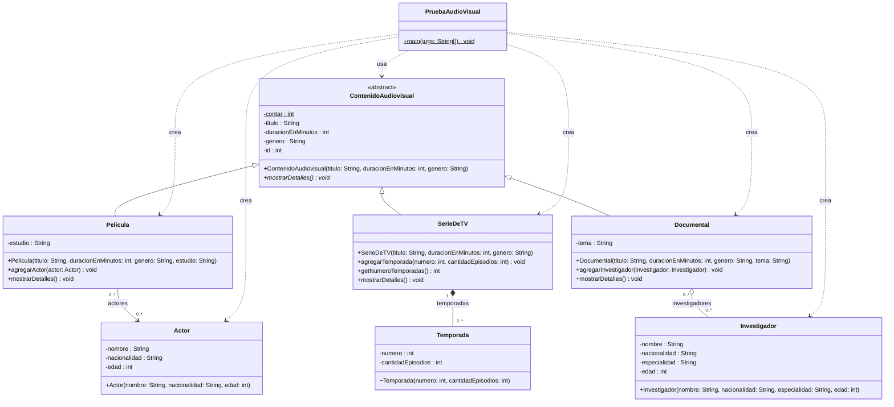

```mermaid
classDiagram
    class ContenidoAudiovisual {
        <<abstract>>
        -contar : int$
        -titulo : String
        -duracionEnMinutos : int
        -genero : String
        -id : int
        +ContenidoAudiovisual(titulo: String, duracionEnMinutos: int, genero: String)
        +mostrarDetalles()* void
    }
    class Pelicula {
        -estudio : String
        +Pelicula(titulo: String, duracionEnMinutos: int, genero: String, estudio: String)
        +agregarActor(actor: Actor) void
        +mostrarDetalles() void
    }
    class SerieDeTV {
        +SerieDeTV(titulo: String, duracionEnMinutos: int, genero: String)
        +agregarTemporada(numero: int, cantidadEpisodios: int) void
        +getNumeroTemporadas() int
        +mostrarDetalles() void
    }
    class Documental {
        -tema : String
        +Documental(titulo: String, duracionEnMinutos: int, genero: String, tema: String)
        +agregarInvestigador(investigador: Investigador) void
        +mostrarDetalles() void
    }
    class Actor {
        -nombre : String
        -nacionalidad : String
        -edad : int
        +Actor(nombre: String, nacionalidad: String, edad: int)
    }
    class Temporada {
        -numero : int
        -cantidadEpisodios : int
        ~Temporada(numero: int, cantidadEpisodios: int)
    }
    class Investigador {
        -nombre : String
        -nacionalidad : String
        -especialidad : String
        -edad : int
        +Investigador(nombre: String, nacionalidad: String, especialidad: String, edad: int)
    }
    class PruebaAudioVisual {
        +main(args: String[]) void$
    }

    ContenidoAudiovisual <|-- Pelicula
    ContenidoAudiovisual <|-- SerieDeTV
    ContenidoAudiovisual <|-- Documental
    Pelicula "0..*" --> "0..*" Actor : actores
    SerieDeTV "1" *-- "0..*" Temporada : temporadas
    Documental "0..*" o-- "0..*" Investigador : investigadores
    PruebaAudioVisual ..> ContenidoAudiovisual : usa
    PruebaAudioVisual ..> Pelicula : crea
    PruebaAudioVisual ..> SerieDeTV : crea
    PruebaAudioVisual ..> Documental : crea
    PruebaAudioVisual ..> Actor : crea
    PruebaAudioVisual ..> Investigador : crea
```