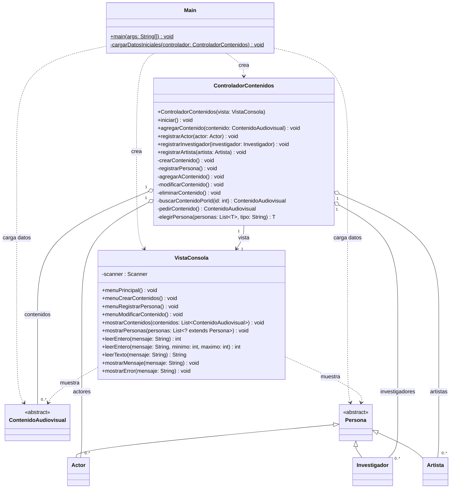

# Diagrama de clases

## 1. Modelo

```mermaid
classDiagram
    class ContenidoAudiovisual {
        <<abstract>>
        -contar : int$
        -titulo : String
        -duracionEnMinutos : int
        -genero : String
        -id : int
        +ContenidoAudiovisual(titulo: String, duracionEnMinutos: int, genero: String)
        +getTipo()* String
        +toString() String
    }
    class Pelicula {
        -estudio : String
        +Pelicula(titulo: String, duracionEnMinutos: int, genero: String, estudio: String)
        +agregarActor(actor: Actor) boolean
        +getTipo() String
        +toString() String
    }
    class SerieDeTV {
        +SerieDeTV(titulo: String, duracionEnMinutos: int, genero: String)
        +agregarTemporada(numero: int, cantidadEpisodios: int) boolean
        +getNumeroTemporadas() int
        +getTipo() String
        +toString() String
    }
    class Documental {
        -tema : String
        +Documental(titulo: String, duracionEnMinutos: int, genero: String, tema: String)
        +agregarInvestigador(investigador: Investigador) boolean
        +getTipo() String
        +toString() String
    }
    class VideoMusical {
        -album : String
        -anioLanzamiento : int
        +VideoMusical(titulo: String, duracionEnMinutos: int, genero: String, album: String, anioLanzamiento: int)
        +agregarArtista(artista: Artista) boolean
        +getTipo() String
        +toString() String
    }
    class TransmisionEnVivo {
        -plataforma : String
        +TransmisionEnVivo(titulo: String, duracionEnMinutos: int, genero: String, plataforma: String)
        +agregarSegmento(titulo: String, duracionEnMinutos: int) boolean
        +calcularDuracion() int
        +getTipo() String
        +toString() String
    }
    class Persona {
        <<abstract>>
        -nombre : String
        -nacionalidad : String
        -edad : int
        #Persona(nombre: String, nacionalidad: String, edad: int)
    }
    class Actor {
        +Actor(nombre: String, nacionalidad: String, edad: int)
    }
    class Investigador {
        -especialidad : String
        +Investigador(nombre: String, nacionalidad: String, especialidad: String, edad: int)
    }
    class Artista {
        -nombreArtistico : String
        +Artista(nombre: String, nacionalidad: String, edad: int, nombreArtistico: String)
    }
    class Temporada {
        -numero : int
        -cantidadEpisodios : int
        ~Temporada(numero: int, cantidadEpisodios: int)
    }
    class Segmento {
        -titulo : String
        -duracionEnMinutos : int
        ~Segmento(titulo: String, duracionEnMinutos: int)
    }

    ContenidoAudiovisual <|-- Pelicula
    ContenidoAudiovisual <|-- SerieDeTV
    ContenidoAudiovisual <|-- Documental
    ContenidoAudiovisual <|-- VideoMusical
    ContenidoAudiovisual <|-- TransmisionEnVivo
    Persona <|-- Actor
    Persona <|-- Investigador
    Persona <|-- Artista
    Pelicula "0..*" --> "0..*" Actor : actores
    SerieDeTV "1" *-- "0..*" Temporada : temporadas
    Documental "0..*" o-- "0..*" Investigador : investigadores
    VideoMusical "0..*" --> "0..*" Artista : artistas
    TransmisionEnVivo "1" *-- "0..*" Segmento : segmentos
```

## 2. Arquitectura MVC

```mermaid
classDiagram
    class Main {
        +main(args: String[]) void$
        -cargarDatosIniciales(controlador: ControladorContenidos) void$
    }
    class VistaConsola {
        -scanner : Scanner
        +menuPrincipal() void
        +menuCrearContenidos() void
        +menuRegistrarPersona() void
        +menuModificarContenido() void
        +mostrarContenidos(contenidos: List~ContenidoAudiovisual~) void
        +mostrarPersonas(personas: List~? extends Persona~) void
        +leerEntero(mensaje: String) int
        +leerEntero(mensaje: String, minimo: int, maximo: int) int
        +leerTexto(mensaje: String) String
        +mostrarMensaje(mensaje: String) void
        +mostrarError(mensaje: String) void
    }
    class ControladorContenidos {
        +ControladorContenidos(vista: VistaConsola)
        +iniciar() void
        +agregarContenido(contenido: ContenidoAudiovisual) void
        +registrarActor(actor: Actor) void
        +registrarInvestigador(investigador: Investigador) void
        +registrarArtista(artista: Artista) void
        -crearContenido() void
        -registrarPersona() void
        -agregarAContenido() void
        -modificarContenido() void
        -eliminarContenido() void
        -buscarContenidoPorId(id: int) ContenidoAudiovisual
        -pedirContenido() ContenidoAudiovisual
        -elegirPersona(personas: List~T~, tipo: String) T
    }
    class ContenidoAudiovisual {
        <<abstract>>
    }
    class Persona {
        <<abstract>>
    }
    class Actor
    class Investigador
    class Artista

    Persona <|-- Actor
    Persona <|-- Investigador
    Persona <|-- Artista
    Main ..> VistaConsola : crea
    Main ..> ControladorContenidos : crea
    Main ..> ContenidoAudiovisual : carga datos
    Main ..> Persona : carga datos
    ControladorContenidos "1" --> "1" VistaConsola : vista
    ControladorContenidos "1" o-- "0..*" ContenidoAudiovisual : contenidos
    ControladorContenidos "1" o-- "0..*" Actor : actores
    ControladorContenidos "1" o-- "0..*" Investigador : investigadores
    ControladorContenidos "1" o-- "0..*" Artista : artistas
    VistaConsola ..> ContenidoAudiovisual : muestra
    VistaConsola ..> Persona : muestra
```