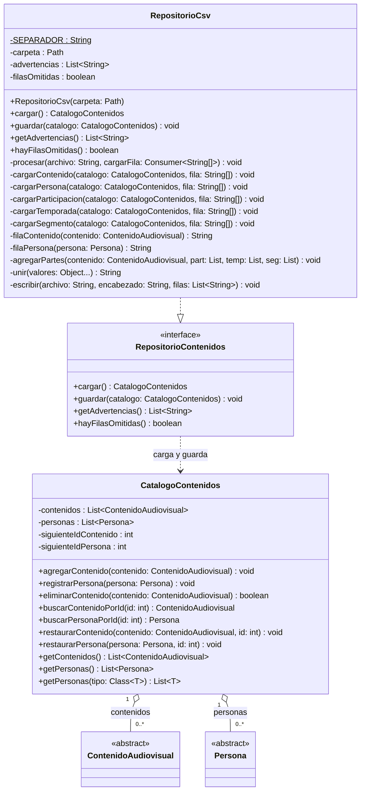
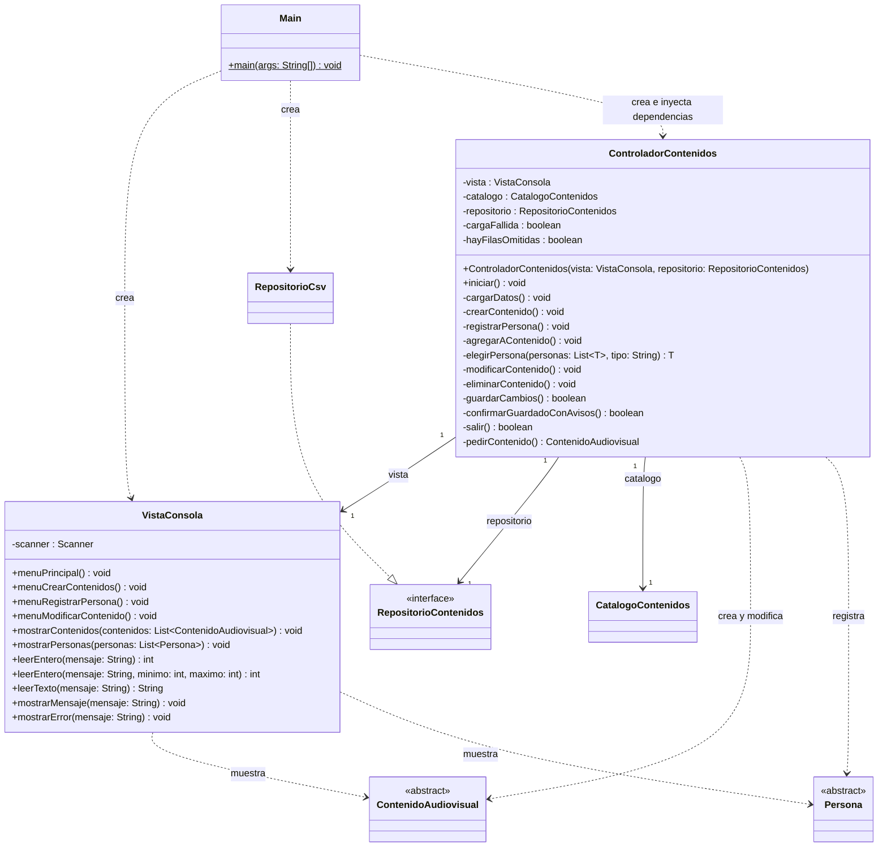

# Diagrama de clases

## 1. Modelo

```mermaid
classDiagram
    class ContenidoAudiovisual {
        <<abstract>>
        -titulo : String
        -duracionEnMinutos : int
        -genero : String
        -id : int
        +ContenidoAudiovisual(titulo: String, duracionEnMinutos: int, genero: String)
        ~asignarId(id: int) void
        +cambiarDuracion(nuevaDuracion: int) boolean
        #esDuracionValida(duracion: int) boolean
        +getTipo()* String
        +toString() String
    }
    class Pelicula {
        -estudio : String
        -actores : Participantes~Actor~
        +Pelicula(titulo: String, duracionEnMinutos: int, genero: String, estudio: String)
        +agregarActor(actor: Actor) boolean
        +getActores() List~Actor~
        +getTipo() String
        +toString() String
    }
    class SerieDeTV {
        -temporadas : List~Temporada~
        +SerieDeTV(titulo: String, duracionEnMinutos: int, genero: String)
        +agregarTemporada(numero: int, cantidadEpisodios: int) boolean
        -existeTemporada(numero: int) boolean
        +getNumeroTemporadas() int
        +getTemporadas() List~Temporada~
        +getTipo() String
        +toString() String
    }
    class Documental {
        -tema : String
        -investigadores : Participantes~Investigador~
        +Documental(titulo: String, duracionEnMinutos: int, genero: String, tema: String)
        +agregarInvestigador(investigador: Investigador) boolean
        +getInvestigadores() List~Investigador~
        +getTipo() String
        +toString() String
    }
    class VideoMusical {
        -album : String
        -anioLanzamiento : int
        -artistas : Participantes~Artista~
        +VideoMusical(titulo: String, duracionEnMinutos: int, genero: String, album: String, anioLanzamiento: int)
        +agregarArtista(artista: Artista) boolean
        +getArtistas() List~Artista~
        +getTipo() String
        +toString() String
    }
    class TransmisionEnVivo {
        -plataforma : String
        -segmentos : List~Segmento~
        +TransmisionEnVivo(titulo: String, duracionEnMinutos: int, genero: String, plataforma: String)
        +agregarSegmento(titulo: String, duracionEnMinutos: int) boolean
        #esDuracionValida(duracion: int) boolean
        +getMinutosDisponibles() int
        +calcularDuracionAgenda() int
        +getSegmentos() List~Segmento~
        +getTipo() String
        +toString() String
    }
    class Temporada {
        -numero : int
        -cantidadEpisodios : int
        ~Temporada(numero: int, cantidadEpisodios: int)
        +toString() String
    }
    class Segmento {
        -titulo : String
        -duracionEnMinutos : int
        ~Segmento(titulo: String, duracionEnMinutos: int)
        +toString() String
    }
    class Participantes~T~ {
        -personas : List~T~
        ~agregar(persona: T) boolean
        ~comoLista() List~T~
        ~listar() String
    }
    class Persona {
        <<abstract>>
        -nombre : String
        -nacionalidad : String
        -edad : int
        -id : int
        #Persona(nombre: String, nacionalidad: String, edad: int)
        ~asignarId(id: int) void
        +toString() String
    }
    class Actor {
        +Actor(nombre: String, nacionalidad: String, edad: int)
    }
    class Investigador {
        -especialidad : String
        +Investigador(nombre: String, nacionalidad: String, especialidad: String, edad: int)
    }
    class Artista {
        -nombreArtistico : String
        +Artista(nombre: String, nacionalidad: String, edad: int, nombreArtistico: String)
        +toString() String
    }
    class Validacion {
        <<utility>>
        -Validacion()
        ~exigirTexto(valor: String, campo: String)$ String
        ~exigirPositivo(valor: int, campo: String)$ int
        ~exigirRango(valor: int, minimo: int, maximo: int, campo: String)$ int
    }

    ContenidoAudiovisual <|-- Pelicula
    ContenidoAudiovisual <|-- SerieDeTV
    ContenidoAudiovisual <|-- Documental
    ContenidoAudiovisual <|-- VideoMusical
    ContenidoAudiovisual <|-- TransmisionEnVivo
    Persona <|-- Actor
    Persona <|-- Investigador
    Persona <|-- Artista
    SerieDeTV "1" *-- "0..*" Temporada : temporadas
    TransmisionEnVivo "1" *-- "0..*" Segmento : segmentos
    Pelicula "1" *-- "1" Participantes : actores
    Documental "1" *-- "1" Participantes : investigadores
    VideoMusical "1" *-- "1" Participantes : artistas
    Participantes "0..*" o-- "0..*" Persona : personas
    ContenidoAudiovisual ..> Validacion : valida datos
    Persona ..> Validacion : valida datos
```

## 2. Catálogo y persistencia

```mermaid
classDiagram
    class CatalogoContenidos {
        -contenidos : List~ContenidoAudiovisual~
        -personas : List~Persona~
        -siguienteIdContenido : int
        -siguienteIdPersona : int
        +agregarContenido(contenido: ContenidoAudiovisual) void
        +registrarPersona(persona: Persona) void
        +eliminarContenido(contenido: ContenidoAudiovisual) boolean
        +buscarContenidoPorId(id: int) ContenidoAudiovisual
        +buscarPersonaPorId(id: int) Persona
        +restaurarContenido(contenido: ContenidoAudiovisual, id: int) void
        +restaurarPersona(persona: Persona, id: int) void
        +getContenidos() List~ContenidoAudiovisual~
        +getPersonas() List~Persona~
        +getPersonas(tipo: Class~T~) List~T~
    }
    class RepositorioContenidos {
        <<interface>>
        +cargar() CatalogoContenidos
        +guardar(catalogo: CatalogoContenidos) void
        +getAdvertencias() List~String~
        +hayFilasOmitidas() boolean
    }
    class RepositorioCsv {
        -SEPARADOR : String$
        -carpeta : Path
        -advertencias : List~String~
        -filasOmitidas : boolean
        +RepositorioCsv(carpeta: Path)
        +cargar() CatalogoContenidos
        +guardar(catalogo: CatalogoContenidos) void
        +getAdvertencias() List~String~
        +hayFilasOmitidas() boolean
        -procesar(archivo: String, cargarFila: Consumer~String[]~) void
        -cargarContenido(catalogo: CatalogoContenidos, fila: String[]) void
        -cargarPersona(catalogo: CatalogoContenidos, fila: String[]) void
        -cargarParticipacion(catalogo: CatalogoContenidos, fila: String[]) void
        -cargarTemporada(catalogo: CatalogoContenidos, fila: String[]) void
        -cargarSegmento(catalogo: CatalogoContenidos, fila: String[]) void
        -filaContenido(contenido: ContenidoAudiovisual) String
        -filaPersona(persona: Persona) String
        -agregarPartes(contenido: ContenidoAudiovisual, part: List, temp: List, seg: List) void
        -unir(valores: Object...) String
        -escribir(archivo: String, encabezado: String, filas: List~String~) void
    }
    class ContenidoAudiovisual {
        <<abstract>>
    }
    class Persona {
        <<abstract>>
    }

    RepositorioCsv ..|> RepositorioContenidos
    RepositorioContenidos ..> CatalogoContenidos : carga y guarda
    CatalogoContenidos "1" o-- "0..*" ContenidoAudiovisual : contenidos
    CatalogoContenidos "1" o-- "0..*" Persona : personas
```

## 3. Arquitectura MVC

```mermaid
classDiagram
    class Main {
        +main(args: String[])$ void
    }
    class VistaConsola {
        -scanner : Scanner
        +menuPrincipal() void
        +menuCrearContenidos() void
        +menuRegistrarPersona() void
        +menuModificarContenido() void
        +mostrarContenidos(contenidos: List~ContenidoAudiovisual~) void
        +mostrarPersonas(personas: List~Persona~) void
        +leerEntero(mensaje: String) int
        +leerEntero(mensaje: String, minimo: int, maximo: int) int
        +leerTexto(mensaje: String) String
        +mostrarMensaje(mensaje: String) void
        +mostrarError(mensaje: String) void
    }
    class ControladorContenidos {
        -vista : VistaConsola
        -catalogo : CatalogoContenidos
        -repositorio : RepositorioContenidos
        -cargaFallida : boolean
        -hayFilasOmitidas : boolean
        +ControladorContenidos(vista: VistaConsola, repositorio: RepositorioContenidos)
        +iniciar() void
        -cargarDatos() void
        -crearContenido() void
        -registrarPersona() void
        -agregarAContenido() void
        -elegirPersona(personas: List~T~, tipo: String) T
        -modificarContenido() void
        -eliminarContenido() void
        -guardarCambios() boolean
        -confirmarGuardadoConAvisos() boolean
        -salir() boolean
        -pedirContenido() ContenidoAudiovisual
    }
    class RepositorioContenidos {
        <<interface>>
    }
    class RepositorioCsv
    class CatalogoContenidos
    class ContenidoAudiovisual {
        <<abstract>>
    }
    class Persona {
        <<abstract>>
    }

    RepositorioCsv ..|> RepositorioContenidos
    Main ..> VistaConsola : crea
    Main ..> RepositorioCsv : crea
    Main ..> ControladorContenidos : crea e inyecta dependencias
    ControladorContenidos "1" --> "1" VistaConsola : vista
    ControladorContenidos "1" --> "1" RepositorioContenidos : repositorio
    ControladorContenidos "1" --> "1" CatalogoContenidos : catalogo
    ControladorContenidos ..> ContenidoAudiovisual : crea y modifica
    ControladorContenidos ..> Persona : registra
    VistaConsola ..> ContenidoAudiovisual : muestra
    VistaConsola ..> Persona : muestra
```